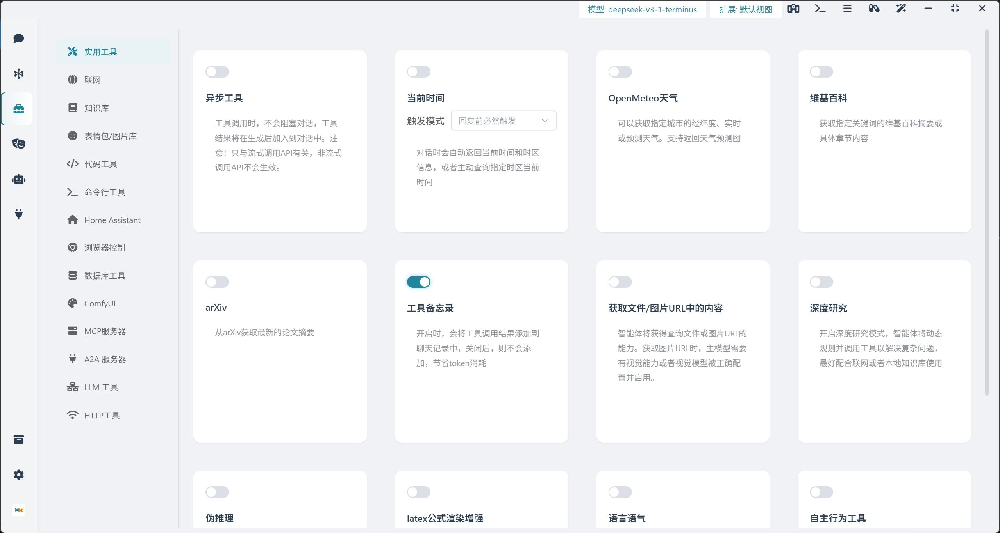
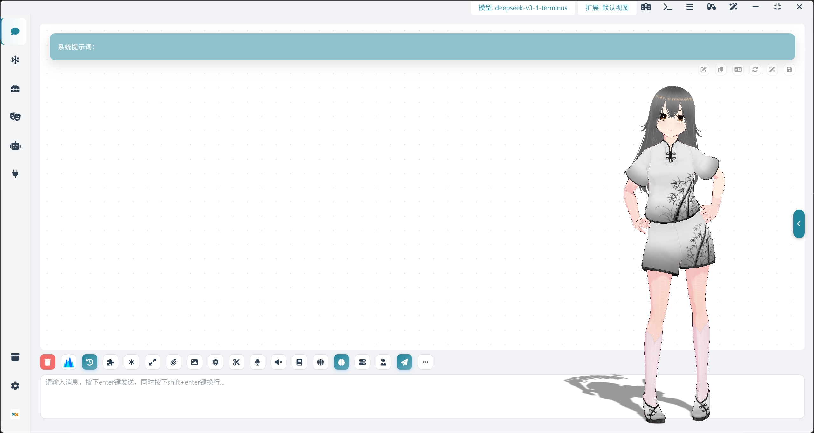
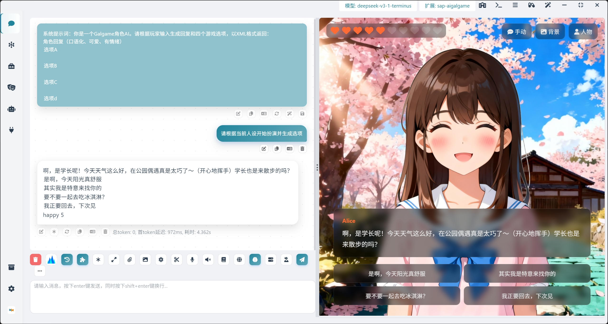
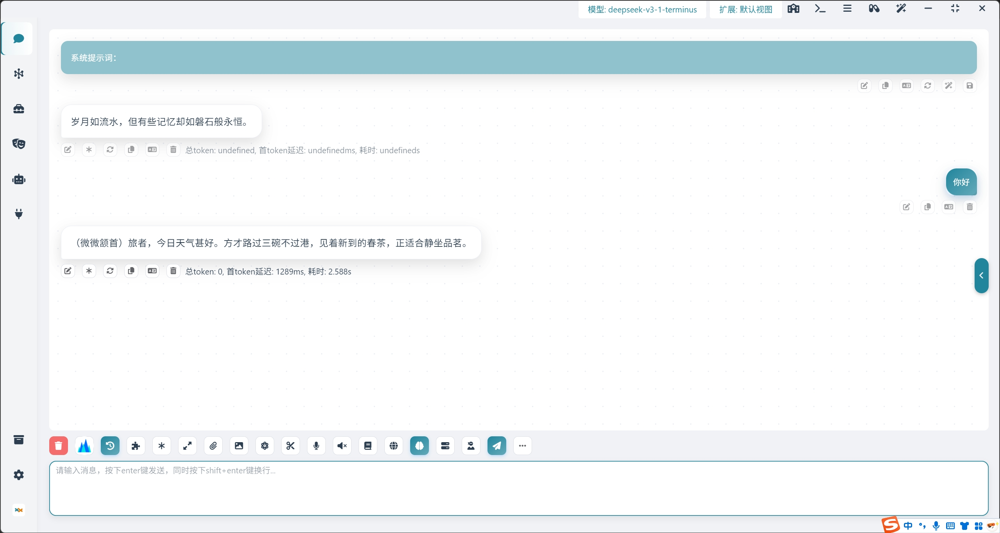
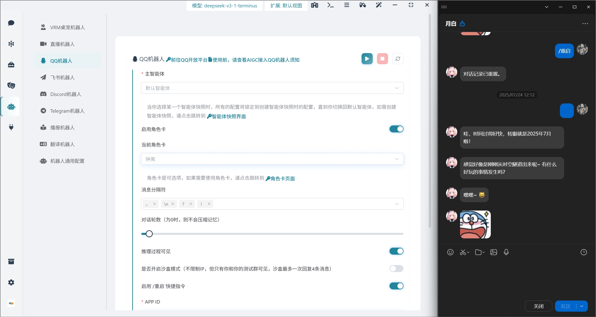
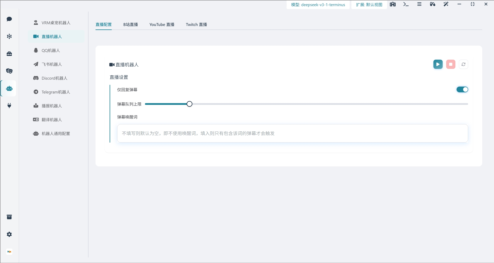
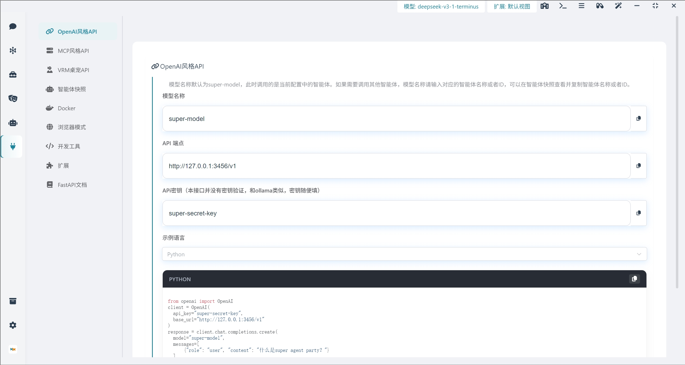

<div align="center">
  <a href="./README_ZH.md">
    
  </a>
  <a href="./README.md">
    
  </a>
</div>

####

<div align="center">
  <a href="https://www.agentparty.top/"></a>
  <a href="https://www.agentparty.top/blog.html"></a>
  <a href="https://space.bilibili.com/26978344"></a>
  <a href="https://www.youtube.com/@LLM-party"></a>
  <a href="https://gcnij7egmcww.feishu.cn/wiki/DPRKwdetCiYBhPkPpXWcugujnRc"></a>
  <a href="https://temporal-lantern-7e8.notion.site/super-agent-party-211b2b2cb6f180c899d1c27a98c4965d"></a>
  <a href="./README_ZH.md#快速开始"></a>
  <a href="#quick-start"></a>
</div>

## Introduction

### 🚀 **An AI desktop companion with endless possibilities!**  

- ✅ Omnichannel One-Click Deployment: Supports rapid deployment of agent configurations to multiple terminals, already compatible with scenarios such as classic chat interfaces, desktop companion, QQ, Feishu, Discord, Telegram chatbots, Bilibili, YouTube, Twitch live-streaming bots, and more—ready to use out of the box.  

- ✅ Ecosystem Tool Interconnectivity: Freely integrates third-party agents and workflows as toolchains (already adapted for systems like Home Assistant, Claude Code, Qwen Code, Dify, ComfyUI, MCP, A2A, etc.), enabling cross-platform capability aggregation through the Agent-Party architecture.  

- ✅ Rich Extension Ecosystem: Supports custom extension development, with community sharing via the official [Extension Marketplace](https://super-agent-party.github.io/plugins.html) to meet personalized needs.  

- ✅ Standardized interface openness: Provides OpenAI API-compatible interfaces and MCP protocol support, facilitating developers' direct integration with external systems for rapid agent capability transfer and secondary development. The VRM desktop pet supports the VMC protocol, enabling cross-application action synchronization. The VRM desktop pet interface also supports the webXR protocol, allowing immersive experiences on XR-compatible devices.

- ✅ Seamless capability enhancement: It is possible to achieve an enterprise-level upgrade of the LLM API without code modification, seamlessly integrating knowledge bases, real-time networking, permanent memory, compatible SillyTavern Character Card, code execution, multimodal capabilities (vision/drawing/audition/speech), Automation capabilities (controlling smart homes, controlling browsers), deep thinking control and research, and other modular functions into the existing model interface, creating a pluggable LLM enhancement platform.

- ✅ Compatible and adaptable across all platforms: It covers the native running environments of Windows/macOS/Linux, supports Docker containerized deployment and web-based cloud services, and meets the needs of multi-scene technology stacks.

## Software Screenshots

### Multi-Service Provider Support: Supports both locally deployed engines (e.g., Ollama, Dify) and cloud service provider APIs.


### Extensive Tool Integration: Built-in various tools (e.g., knowledge base, web search, smart home control, browser automation), supporting asynchronous invocation without blocking agent responses.


### VRM Desktop Pet: Supports uploading custom VRM models to create a personalized desktop companion.


### Extension System: Supports installing extensions and creating new ones. The image below shows a galgame extension.  


### Tavern Character Cards: Supports Tavern character cards with long-term memory capabilities.


### Social platform bots: Support one-click deployment to QQ, Lark, Telegram, Discord.


### Live Streaming Bot: Supports One-Click Deployment to Bilibili, YouTube, and Twitch


### Developer-Friendly: Provides open OpenAI API and MCP interfaces, allowing the agent to be exposed externally.


### AI Browser: Empower Your AI Agents with Their Own Browser, Supporting Automatic Control


## Quick Start

### 中国用户下载请点击 **中国用户点击下载** 的链接！

### Windows portable package (Recommended! Installation-free source version, support one-click synchronization to the latest version of the warehouse, no need to wait for the desktop version to be packaged)

  👉 [Click to download](https://github.com/heshengtao/super-agent-party/releases/download/v0.3.6/super-agent-party-win-v0.3.6.7z)
  👉 [中国用户点击下载](https://modelscope.cn/models/ailm32442/super-agent-party-portable/resolve/master/v0.3.6/super-agent-party-win-v0.3.6.7z)

⭐ Note!  You can double-click `一键更新(update).bat` to update the software, or you can double-click `一键启动(start).bat` to start the software.The operating system must be **Windows 10/11, Windows Server 2025**, or a later version!

### Windows Desktop Installation

  👉 [Click to download](https://github.com/heshengtao/super-agent-party/releases/download/v0.3.6/Super-Agent-Party-Setup-0.3.6.exe)
  👉 [中国用户点击下载](https://modelscope.cn/models/ailm32442/super-agent-party-portable/resolve/master/v0.3.6/Super-Agent-Party-Setup-0.3.6.exe)

⭐ Note! Choose to install only for the current user during installation, otherwise, administrator privileges will be required to start.The operating system must be **Windows 10/11, Windows Server 2025**, or a later version!

### macOS portable package (Currently only M chips are supported, developer-oriented, no-install source version, one-click sync to latest repo, no need to wait for desktop build)

  👉 [Click to download](https://github.com/heshengtao/super-agent-party/releases/download/v0.3.6/super-agent-party-mac-v0.3.6.7z)
  👉 [中国用户点击下载](https://modelscope.cn/models/ailm32442/super-agent-party-portable/resolve/master/v0.3.6/super-agent-party-mac-v0.3.6.7z)

⭐ Note! You can update the software in Terminal with `one-click update(update).sh` or launch it with `one-click start(start).sh`. Remember to grant permissions before use!

  ```shell
  chmod +x 一键更新(update).sh
  ./一键更新(update).sh
  chmod +x 一键启动(start).sh
  ./一键启动(start).sh
  ```

### MacOS Desktop Installation (Currently only M chips are supported.)

  👉 [Click to download](https://github.com/heshengtao/super-agent-party/releases/download/v0.3.6/Super-Agent-Party-0.3.6-Mac.dmg)
  👉 [中国用户点击下载](https://modelscope.cn/models/ailm32442/super-agent-party-portable/resolve/master/v0.3.6/Super-Agent-Party-0.3.6-Mac.dmg)

⭐Attention! After downloading, drag the app file of the dmg file into the `/Applications` directory, then open end point, execute the following command and enter the root password to remove the attached Quarantine attribute from the network download:

  ```shell
  sudo xattr -dr com.apple.quarantine /Applications/Super-Agent-Party.app
  ```

### Linux Desktop Installation

We provide two mainstream Linux installation package formats for your convenience in different scenarios.

#### 1. Install using `.AppImage`

`.AppImage` is a Linux application format that does not require installation and can be used immediately. Suitable for most Linux distributions.

  👉 [Click to download](https://github.com/heshengtao/super-agent-party/releases/download/v0.3.6/Super-Agent-Party-0.3.6-Linux.AppImage)

#### 2. Install using `.deb` package (Suitable for Ubuntu/Debian systems)

  👉 [Click to download](https://github.com/heshengtao/super-agent-party/releases/download/v0.3.6/Super-Agent-Party-0.3.6-Linux.deb)

### Docker Deployment (This version of the table pet can only be viewed through the browser.)

- Two commands to install this project:
  ```shell
  docker pull ailm32442/super-agent-party:latest
  docker run -d -p 3456:3456 -v ./super-agent-data:/app/data ailm32442/super-agent-party:latest
  ```

- ⭐Note! `./super-agent-data` can be replaced with any local folder, after Docker starts, all data will be cached in this local folder and will not be uploaded anywhere.

- Ready to use: access http://localhost:3456/

### Docker Compose Deployment (This version of the desktop pet can only be viewed through a browser. An additional gateway container will be started for login management.)

- Install the project:

  ```shell
  git clone https://github.com/heshengtao/super-agent-party.git
  cd super-agent-party
  docker-compose up -d
  ```

- ⭐Note! The default username is `root`, and the default password is `pass`. Please change the password after the first login.

- Ready to use: Visit http://localhost:3456/

- API key management: Visit http://localhost:3456/token.html

### Lite client that matches your Docker version, turning Docker into a desktop app

👉 [SAP-lite-Windows-exe](https://github.com/heshengtao/desktop-for-sap/releases/download/v0.1.1/super-agent-party-lite-Setup-0.1.1.exe)

👉 [SAP-lite-MacOS-dmg](https://github.com/heshengtao/desktop-for-sap/releases/download/v0.1.1/super-agent-party-lite-0.1.1-Mac.dmg)

### Source Code Deployment

  ```shell
  git clone https://github.com/heshengtao/super-agent-party.git
  cd super-agent-party
  uv sync
  npm install
  npm run dev
  ```

## Extension

Added a brand-new extension system. You can check available plugins at [plugins list](https://super-agent-party.github.io/plugins.html), or directly view and install them in the party under 【Developer】->【Extensions】. You can also add your own developed extensions to the official plugin list at [super-agent-party.github.io](https://github.com/super-agent-party/super-agent-party.github.io)! 

## Hardware requirements

- CPU: 2 cores or more
- Memory: 2GB or more

**Because all models are optional, you can access the local deployment engine, or you can all use the Cloud as a Service provider interface, so there are few hardware requirements. Test the docker version on the 2-core 2G Cloud as a Service server and it will work fine**

## Usage

- Desktop: Click the desktop icon to use immediately.

- Web or docker: Access http://localhost:3456/ after startup.

- API call: Developer-friendly, perfectly compatible with OpenAI format, can output in real-time, and does not affect the original API's response speed. No need to modify the calling code:

  ```python
  from openai import OpenAI
  client = OpenAI(
    api_key="super-secret-key",
    base_url="http://localhost:3456/v1"
  )
  response = client.chat.completions.create(
    model="super-model",
    messages=[
        {"role": "user", "content": "What is Super Agent Party?"}
    ]
  )
  print(response.choices[0].message.content)
  ```

- MCP call: After starting, you can invoke the local MCP service by writing the following content in the configuration file:

  ```json
  {
    "mcpServers": {
      "super-agent-party": {
        "url": "http://127.0.0.1:3456/mcp",
      }
    }
  }
  ```

## Features

Please refer to the following document for the main functions:
  - 👉 [Chinese document](https://gcnij7egmcww.feishu.cn/wiki/DPRKwdetCiYBhPkPpXWcugujnRc)
  - 👉 [English document](https://temporal-lantern-7e8.notion.site/super-agent-party-211b2b2cb6f180c899d1c27a98c4965d)

| Feature | Details |
| --- | --- |
| Supported Model Service Providers | Supports common local deployment engine interfaces and cloud service provider interfaces, such as: openai/ollama/dify, etc. |
| Multimodal Model Integration | Integrates various types of models including role-playing, reasoning, vision, image generation, speech recognition, and speech synthesis for combined use. |
| VRM Desktop Pet Robot | Highly customizable with support for custom avatars, custom animations, voice interaction, and dialogue interruption.It can be streamed transparently to screen recording software such as OBS, and supports bidirectional VMC protocol! |
| Messaging Platform Bots | Currently supports QQ, Feishu, Discord, Telegram, with more platforms to be added later |
| Live Streaming Bots | Currently supports Bilibili, YouTube, Twitch, with more platforms to be added later |
| Announcer Bot | Supports long text narration, multi-voice narration, digital human video narration, batch conversion of ultra-long texts to speech (with download capability), and parsing of common ebook formats like EPUB. Chapter-based conversion will be developed later. |
| Chat Interface | The chat interface supports front-end rendering features such as A2UI, mathematical formulas, mermaid diagrams, and HTML code graphics. Images can be downloaded or copied.Supports capsule mode and assistant mode, making it easy to shrink and dock the conversation interface. Combined with desktop vision and screenshots, it seamlessly integrates into work and entertainment |
| Role-Playing | Supports uploading, editing, and downloading tavern character cards. Allows configuring different voices and avatars for different characters. Features long-term memory, multi-voice support when using character cards, narrator voice for non-character text, and supports emojis and memes. |
| Extensive Native Tools | Tool calling supports asynchronous execution, including web search, knowledge base access, smart home control, browser control, code execution in sandbox environments, controlling ComfyUI for image generation, and Claude code operates the file system. |
| Custom Tool Interfaces | Supports MCP, A2A, HTTP requests, and any LLM interface as tools for the main agent, enabling users to freely customize their agent's toolchain. |
| Open External APIs | Developer-friendly with open APIs simulating OpenAI and MCP, as well as desktop pet APIs. |
| Extension System | You can check out the available plugins in the [Extension List](https://super-agent-party.github.io/plugins.html). You can also view and install plugins directly in Party by navigating to 【Developer】 -> 【Extensions】. You can add your own developed extensions to the official extension list at [super-agent-party.github.io](https://github.com/super-agent-party/super-agent-party.github.io)! |
| Storage Space | All files and data are stored in the user's local data folder. When deployed with NAS, it can also serve as a personal image or file host within the local network. |

## Disclaimer:
This open-source project and its content (hereinafter referred to as the "project") are for reference only and do not imply any explicit or implicit warranties. The project contributors do not assume any responsibility for the completeness, accuracy, reliability, or applicability of the project. Any behavior that relies on the project content shall be at the user's own risk. In any case, the project contributors shall not be liable for any indirect, special, or incidental losses or damages arising from the use of the project content.

## Special Note  
1. Certain features of this open-source project (such as Edge TTS voice synthesis, Bilibili WebSocket danmaku monitoring, etc.) rely on public interfaces or experimental functionalities provided by third-party services. These features may become unavailable at any time due to changes in third-party policies. The developer assumes no responsibility for their stability, legality, or continuity.By using this project, users are deemed to have understood and agreed to assume the associated risks. The developer does not recommend or encourage the use of these functions for commercial or large-scale deployment scenarios.

2. The QQ bot utilizes the official QQ bot interface. Please comply with the [AIGC QQ Bot Usage Guidelines](https://q.qq.com/#/news/detail?id=1376238e8e2fbbc036676bb09d2f37da).

3. The browser control functionality provided in this project is an accessibility-assisted browsing interface based on large language models (LLMs). It is designed to help visually impaired individuals, the elderly, or those with mobility challenges operate browsers more conveniently through natural language commands, using AI visual recognition technology. It is not intended for automated crawling or hacking purposes. The project adopts a technical architecture of "LLM visual reasoning → single-step operation." The accessibility-assisted browsing interface has the following characteristics:  
   a. Non-high-frequency concurrency: Due to reliance on LLM reasoning speed (3–5 seconds per step) and built-in randomized human-like delay algorithms, the tool's operation frequency is strictly lower than the maximum manual speed of a typical human user.  
   b. No server pressure: This tool does not support multi-threaded concurrency, batch data scraping, or DDoS attacks. From the server's perspective, its behavior is indistinguishable from that of a regular human user and will not impose additional load on the target website's server.

4. Do not use this project on banking, payment gateway, or highly confidential information pages. The developer is not responsible for privacy breaches caused by improper user operations. Prohibited behaviors include large-scale data scraping, bypassing security mechanisms, network interference, and violations of laws and regulations.

5. Any third-party trademarks, logos, or brand names appearing in this project (including but not limited to OpenAI, Microsoft, Google, Bing, Bilibili, etc.) are the property of their respective owners. These identifiers are displayed solely for the convenience of users to recognize the models or services used and do not imply any official affiliation, sponsorship, or endorsement by these rights holders. If the relevant trademark, interface, or brand owner believes that the use of this project is inappropriate or does not wish their brand identifiers/interfaces to be displayed or accessed through this software, please contact the repository administrator via GitHub Issues or hst97@qq.com. We will promptly (usually within 48 hours) remove, delete, or modify the content as requested upon receiving notice.

6. This project is an independently developed open-source tool. When users utilize this software to access third-party API services, they are responsible for complying with the relevant service providers' Terms of Service.

7. Any content generated by this software through third-party large models is the responsibility of the model providers and user actions in terms of accuracy, completeness, and compliance. The author of this software assumes no legal liability for such content.

## License Agreement

This project uses a dual licensing model:
1. By default, this project follows the **GNU Affero General Public License v3.0 (AGPLv3)** license agreement
2. If you need to use this project for closed-source commercial purposes, you must obtain a commercial license from the project administrator. Business cooperation: hst97@qq.com

Using this project for closed-source commercial purposes without written authorization is considered a violation of this agreement. The complete text of AGPLv3 can be found in the LICENSE file in the project root directory or at [gnu.org/licenses](https://www.gnu.org/licenses/agpl-3.0.html).

### Third-Party License Notices  

This project may include or depend on certain third-party libraries or components, whose licenses may differ from the main project's license. To comply with the relevant license requirements, you can find the license information for these third-party components in the [LICENSE-third-party](./LICENSE-third-party) folder located in the project's root directory, or within the corresponding component's source code.  

We extend our gratitude to all contributors of the third-party libraries and components and are committed to respecting their license terms.

## Support:

### Please star us!
⭐Your support is the driving force for us to move forward!

<div align="center">
  
</div>

### Follow us
<div align="center">
  <a href="https://space.bilibili.com/26978344">
    
  </a>
  <a href="https://www.youtube.com/@agentParty">
    
  </a>
</div>

<div align="center">
  <a href="https://www.youtube.com/watch?v=fIzlQOsuhZE" target="_blank">
    
  </a>
</div>

### Join the Community
If you have any questions or issues with the project, you are welcome to join our community.

1. QQ Group: `931057213`

<div style="display: flex; justify-content: center;">
    
</div>

2. WeChat Group: `we_glm` (add the assistant's WeChat and join the group)

3. Discord: [Discord link](https://discord.gg/f2dsAKKr2V)

## Star History

[](https://www.star-history.com/#heshengtao/super-agent-party&Date)